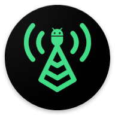
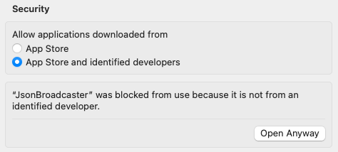

# JsonBroadcaster

Update the UI state of your Android and iOS apps at runtime.

## Motivation

Updating the UI State at runtime is a very useful tool for rapid prototyping and validation purposes. It also adds the benefit that it can be used by the whole testing team, be it developers, designers, quality assurance, etc.

https://github.com/GuilhE/JsonBroadcaster/assets/2677139/10cf81ed-0895-4f68-899d-412e28a43481

## How does it work

### Android

Android Debug Bridge ([ABD](https://developer.android.com/studio/command-line/adb)) is used to send a broadcast signal to the desired application with a `json` payload as an extra.

```
adb shell am broadcast -p [package] -a [action] -e [extra key] [extra value]
```

On the application side there's a `BroadcastReceiver` listening for theses payloads. Upon successful deserialization, a fresh state will be emitted, consequently triggering a UI update.

**Availability**: all simulators and/or physical devices (even with wifi debug) connected.

### iOS

Apple's Xcode developer tools provides a command-line tool for interacting with the iOS Simulator.  
This tool allows you to simulate the process of sending push notifications to a device:

```
xcrun simctl push [UDID] [bundle id] [path to .apns] 
```
  
On the application side there's a `NotificationBroadcaster` actively monitoring incoming notifications. These notifications are then relayed to internal observers within the application. Upon successful deserialization, a fresh state will be emitted, consequently triggering a UI update.

**Availability**: all booted simulators.

## Installation

### Android

Add the library dependency:

```kotlin
implementation("com.github.guilhe:json-broadcast-handler:${LATEST_VERSION}'")
```
[](https://search.maven.org/search?q=g:com.github.guilhe%20AND%20json-broadcast-handler)

### iOS

#### Swift Package Manager

The Swift implementations are available via the Swift Package Manager. Just add it in Xcode by going to `File` > `Add Packages...` and providing the URL https://github.com/GuilhE/JsonBroadcaster.git.

#### CocoaPods

If you use CocoaPods add the following to your `Podfile`:
```ruby 
pod 'JsonBroadcasterHandler', :git => 'https://github.com/GuilhE/JsonBroadcaster.git', :tag => '[desired version]'
```

## Usage: developers

### Android

1. Your `UiState` classes must be annotated with `kotlinx.serialization.Serializable` ([dependency](https://github.com/Kotlin/kotlinx.serialization)):

   ```kotlin
   @Serializable
   data class UiState(val memberA: String, val memberB: String)
   ```

2. Create a `BroadcastUiModelHost` implementation to listen for state updates, as shown bellow:

   ```kotlin
   private val host = object : BroadcastUiModelHost<UiState>(coroutineScope, UiState.serializer()) {
       override fun updateState(new: UiState) {
           //...
       }
   }
   ```
   
3. Add it where it fits best in your project, examples:

   If you are using `androidx.lifecycle.ViewModel` you can do the following:
   ```kotlin
   class MatchViewModel : ViewModel() {
   
       private val _uiState = MutableStateFlow(MatchUiState(home = Team("PRT", "🇵🇹"), away = Team("BRA", "🇧🇷")))
       val uiState: StateFlow<MatchUiState> = _uiState
   
       private val host = object : BroadcastUiModelHost<MatchUiState>(viewModelScope, MatchUiState.serializer()) {
           override fun updateState(new: MatchUiState) {
               _uiState.update { new }
           }
       }
   }
   ```
   
   But actually you don't need a `ViewModel`, you can simply use a `@Composable` for instance:
   
   ```kotlin
   @Composable
   fun MatchScreen() {
       var uiState: MatchUiState by remember { mutableStateOf(MatchUiState(home = Team("PRT", "🇵🇹"), away = Team("BRA", "🇧🇷"))) }
       LaunchedEffect(Unit) {
           val host = object : BroadcastUiModelHost<MatchUiState>(this, MatchUiState.serializer()) {
               override fun updateState(new: MatchUiState) {
                   uiState = new
               }
           }
       }
       Match(uiState)
   }
   ```

   And the beauty of it is that you may choose whatever suits you best: `ViewModel`, `@Composable`, `Activity`, `Fragment`, etc...

4. To disable it, for instance in release builds, override the `receiver` declaration in the `AndroidManifest` by adding a `manifestPlaceholders` property in the `build.gradle`:

   ```kotlin
   android {
       buildTypes {
           getByName("release") {
               manifestPlaceholders["enableJsonBroadcastReceiver"] = false
           }
   
           getByName("debug") {
               manifestPlaceholders["enableJsonBroadcastReceiver"] = true
           }
       }
   }
   ```
   ```xml
   <receiver
       android:name="com.broadcast.handler.JsonBroadcasterReceiver"
       android:exported="${enableJsonBroadcastReceiver}"
       tools:replace="android:exported">
       <intent-filter>
           <action android:name="JsonBroadcaster.extra" />
       </intent-filter>
   </receiver>
   ```

### iOS

1. Your `UiState` classes must implement the `Codable` protocol:

   ```swift
   struct UiState: Codable {
       let memberA: String
       let memberB: String
   }
   ```
   
2. Create a `BroadcastUIModelHost` instance inside a `class` to listen for state updates, as shown bellow:

   ```swift
   private var uiModelHost: BroadcastUIModelHost<MatchUiState>!
   init() {
        uiModelHost = BroadcastUIModelHost(state) { [weak self] newState in
            //...
        }        
    }
   ```
   
3. Add it where it fits best in your project, example:

   If you are using an `ObservableObject` you can do the following:
   ```swift
   class MatchViewModel: ObservableObject {
      private var uiModelHost: BroadcastUIModelHost<MatchUiState>!
      @Published var state: MatchUiState = MatchUiState(home: Team(country:"PRT", flag:"🇵🇹"), away: Team(country:"BRA", flag:"🇧🇷"))
    
      init() {
        uiModelHost = BroadcastUIModelHost(state) { [weak self] newState in
            self?.state = newState
        }
      }
   } 
   ```
   And the beauty of it is that you may choose whatever suits you best, `SwiftUI` or `UIKit`:
   ```swift
   struct MatchScreen: View {
      @StateObject private var viewModel = MatchViewModel() 

      var body: some View {
        ZStack { }
        .onReceive(viewModel.$state) { new in
            //...
        }
    }
   ``` 
   ```swift
   class MatchScreen: UIViewController {
      private var viewModel: MatchViewModel!
      private var cancellables = Set<AnyCancellable>()

      override func viewDidLoad() {
        super.viewDidLoad()
        viewModel = MatchViewModel()
        viewModel.$state
            .receive(on: DispatchQueue.main)
            .sink { [weak self] state in
                self?.updateUI(with: state)
            }
            .store(in: &cancellables)
      }
      
      private func updateUI(with state: MatchUiState) {
        //...
      }
   }
   ```
   
4. Inside your `AppDelegate` register for `RemoteNotifications` and forward them with the `NotificationBroadcaster`:

   ```swift
   import UIKit
   import UserNotifications

   class AppDelegate: UIResponder, UIApplicationDelegate, UNUserNotificationCenterDelegate {
       
       func application(_ application: UIApplication, didFinishLaunchingWithOptions launchOptions: [UIApplication.LaunchOptionsKey: Any]?) -> Bool {
           UNUserNotificationCenter.current().delegate = self
           application.registerForRemoteNotifications()
           return true
       }
       
       func userNotificationCenter(_ center: UNUserNotificationCenter, willPresent notification: UNNotification, withCompletionHandler completionHandler: @escaping (UNNotificationPresentationOptions) -> Void) {
           NotificationBroadcaster.broadcast(notification)
       }
   }   
   ```
   
   **tip**: You may create a compiler custom flags, DEBUG_MODE, to encapsulate the `NotificationBroadcaster`:
   ```swift       
   func userNotificationCenter(_ center: UNUserNotificationCenter, willPresent notification: UNNotification, withCompletionHandler completionHandler: @escaping (UNNotificationPresentationOptions) -> Void) {
      #if DEBUG_MODE
         NotificationBroadcaster.broadcast(notification)
      #endif
   }
   ```


## Usage: testing team

### Android
1. Google's Android SDK must be installed in order to use command line tools;
2. Ask for an installed version of the app (wifi debug or cable connected);
3. Use the __desktopApp__ GUI.

### iOS
1. Apple's XCode must be installed in order to use command line tools;
2. Open XCode and run a simulator with the app;
3. Use the __desktopApp__ GUI.

## Desktop app

Although we can use the terminal to send commands, it's not practical. The __desktopApp__ provides a simple user interface to help us with that task.

To run it you can either:  
- Clone this project and type `./gradlew :desktopApp:run` in the terminal.
- Download a `.dmg` (only MacOS) and install it. Get it [here](./artifacts/JsonBroadcaster.dmg).

__note:__ due to security reasons, since this app is not from an Identified Developer, MacOS will block its execution. To by pass it you'll need to click in "Open Anyway" in System Settings under Security. It's only needed once:



(This wont happen with the first approach)

## Playgrounds

Use the following payload to get you started:
```json
{
   "home":{
      "country":"PRT",
      "flag":"🇵🇹"
   },
   "away":{
      "country":"BRA",
      "flag":"🇧🇷"
   },
   "homeGoals":0,
   "awayGoals":0,
   "started": false,
   "running": false,
   "finished": false
}
```

### Android

Inside the __sample__ module you'll find a playground app ready for you to test it.

To run it you can either:
- Clone this project and type `./gradlew :androidApp:installDebug` in the terminal.
- Download the sample `.apk` and install it. Get it [here](./artifacts/matchday.apk).

The `applicationId` is _com.jsonbroadcaster.matchday_

### iOS

Inside the __sample-ios__ folder you'll find a playground app ready for you to test it.  

To run it:
 - Open it in Xcode and run standard configuration.

## LICENSE

Copyright (c) 2022-present GuilhE

Licensed under the Apache License, Version 2.0 (the "License"); you may not use this file except in compliance with the License. You may obtain a copy
of the License at

<http://www.apache.org/licenses/LICENSE-2.0>

Unless required by applicable law or agreed to in writing, software distributed under the License is distributed on an "AS IS" BASIS, WITHOUT
WARRANTIES OR CONDITIONS OF ANY KIND, either express or implied. See the License for the specific language governing permissions and limitations under
the License.
