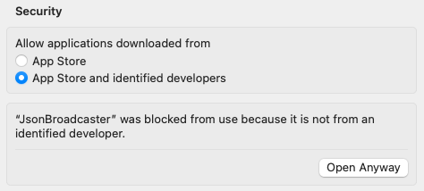

# JsonBroadcaster

Update your app's Ui State at runtime.

## Motivation

Updating the Ui State at runtime is a very useful tool for quick drafts and validations. It also adds the benefit that it can be used by the whole testing team, be it developers, designers, quality assurance, etc.

It works both on the emulator or physical device (even with wifi debug).

## How does it work

Android Debug Bridge ([ABD](https://developer.android.com/studio/command-line/adb)) is used to send a broadcast signal to the desired application with a `json` payload as an extra.

```
adb shell am broadcast -p [package] -a [action] -e [extra key] [extra value]
```

On the application side there's a `BroadcastReceiver` listening for theses payloads. If they are successfully deserialize a new state will be emitted and thus a Ui update.

## Setup

### For developers

1. Add the library dependency:

```kotlin
implementation("com.github.guilhe:json-broadcast-handler:${LATEST_VERSION}")
```
[](https://search.maven.org/search?q=g:com.github.guilhe%20AND%20json-broadcast-handler)

2. Your `UiState` classes must be annotated with `kotlinx.serialization.Serializable` ([dependency](https://github.com/Kotlin/kotlinx.serialization)):

```kotlin
@Serializable
data class UiState(val a: String, val b: Boolean, val c: Int)
```

3. Create a `BroadcastUiModelHost` implementation to listen for state updates, as shown bellow:

```kotlin
private val host = object : BroadcastUiModelHost<UiState>(coroutineScope, UiState.serializer()) {
    override fun updateState(new: UiState) {
        //...
    }
}
```
4. Add it where it fits best in your project, examples:

If you are using `androidx.lifecycle.ViewModel` you can do the following:
```kotlin
class MatchViewModel : ViewModel() {

    private val _uiState = MutableStateFlow(MatchUiState(home = Team("PRT", "🇵🇹"), away = Team("BRA", "🇧🇷")))
    val uiState: StateFlow<MatchUiState> = _uiState

    private val host = object : BroadcastUiModelHost<MatchUiState>(viewModelScope, MatchUiState.serializer()) {
        override fun updateState(new: MatchUiState) {
            _uiState.update { new }
        }
    }
}
```

But actually you don't need a `ViewModel`, you can simply use a `@Composable` for instance:

```kotlin
@Composable
fun MatchScreen() {
    var uiState: MatchUiState by remember { mutableStateOf(MatchUiState(home = Team("PRT", "🇵🇹"), away = Team("BRA", "🇧🇷"))) }
    LaunchedEffect(Unit) {
        val host = object : BroadcastUiModelHost<MatchUiState>(this, MatchUiState.serializer()) {
            override fun updateState(new: MatchUiState) {
                uiState = new
            }
        }
    }
    Match(uiState)
}
```

And the beauty of it is that you may choose whatever suits you best: `ViewModel`, `@Composable`, `Activity`, `Fragment`, etc...

### For the testing team

1. Google's Android SDK must be installed in order to use command line tools;
2. Use the __desktopApp__ GUI;
3. Ask for the `applicationId` value and an installed version of the app.

## Desktop app

Although we can use the terminal to send broadcast commands, it's not practical. The __desktopApp__ provides a simple user interface to help us with that task.

To run it you can either:
- Clone this project and type `./gradlew :desktopApp:run` in the terminal;
- Download a `TargetFormat.Dmg` (only MacOS for now) and install it. Get it [here](./artifacts/JsonBroadcaster.dmg).

__note:__ due to security reasons, since this app is not from an Identified Developer, MacOS will block its execution. To by pass it you'll need to click in "Open Anyway" in System Settings under Security. It's only needed once:



(This wont happen with the first approach)

## Sample app

Inside the __sample__ module you'll find a playground app ready for you to test it.

To run it you can either:
- Clone this project and type `./gradlew :sample:installDebug` in the terminal;
- Download the sample `.apk` and install it. Get it [here](./artifacts/matchday.apk).

The `applicationId` is _com.matchday_ and you can use the following payload to get you started:
```json
{
   "home":{
      "country":"PRT",
      "flag":"🇵🇹"
   },
   "away":{
      "country":"BRA",
      "flag":"🇧🇷"
   },
   "homeGoals":0,
   "awayGoals":0,
   "started": false,
   "running": false,
   "finished": false
}
```

## Demo

https://user-images.githubusercontent.com/2677139/206770352-d7fc3c9a-4b43-4198-9e14-e00d6f9943a6.mov

## LICENSE

Copyright (c) 2022-present GuilhE

Licensed under the Apache License, Version 2.0 (the "License"); you may not use this file except in compliance with the License. You may obtain a copy
of the License at

<http://www.apache.org/licenses/LICENSE-2.0>

Unless required by applicable law or agreed to in writing, software distributed under the License is distributed on an "AS IS" BASIS, WITHOUT
WARRANTIES OR CONDITIONS OF ANY KIND, either express or implied. See the License for the specific language governing permissions and limitations under
the License.
